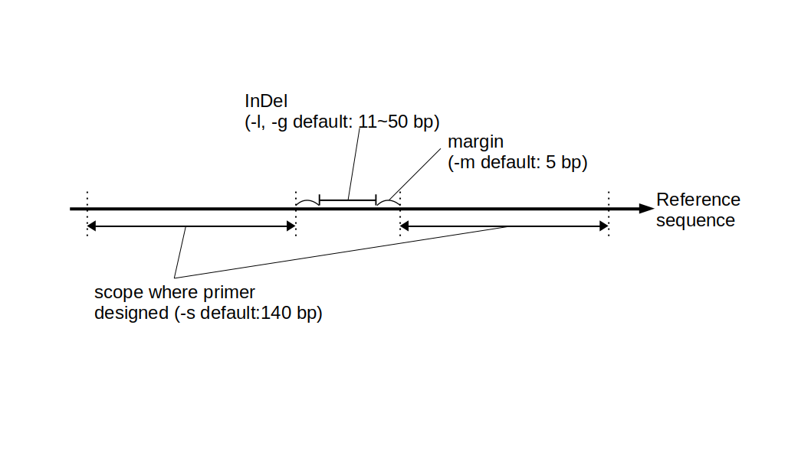

# vcf2primer
Extract variants from the vcf file and design primers that sandwich the variants.

## Requirement
Linux OS<br>
The following packages must be installed.
* perl
* samtools (must be v1.13 or later)
When samtools was installed in conda environment, An error sometimes occur like below,
```
$ samtools -h
samtools: error while loading shared libraries: libcrypto.so.1.0.0: cannot open shared object file: No such file or directory
```
then download library set "linux-64/openssl-1.0.2h-0.tar.bz2" from<br>
https://anaconda.org/conda-forge/openssl/files?page=5
and pick "libcrypto.so.1.0.0" and paste to ~/miniconda3/envs/yourenv/lib/<br>
(for example)<br>
* primer3
https://github.com/primer3-org/primer3
You need to pass the path of the primer3 executable file.<br>
For example,
```
$ vi ~/.bashrc
###Add to the last line
export PATH=$PATH:/home/chigira/primer3/src
###
$ source ~/.bashrc
$ primer3_core -h
```
Usage will be displayed if the path is passed.<br>

## Install
Download the script files by
```
$ cd ~
$ git clone "https://github.com/KChigira/vcf2primer.git"
```
## Usage (Tutorial)
Move to your working directory (for tutrial, "test")<br>
Prepare a vcf file containing mutation data of two or more strains to create a primer and a reference sequence file (.fasta) used to create the vcf file. <br>
In the tutrial set,
* Osa_chr9.fasta
* test_nkw_chr09.vcf
are available.
If fasta file is not indexed, you have to make index file.
```
$ cd ~/vcf2primer/test
$ samtools faidx data/Osa_chr9.fasta
```
Format column of vcf file must contain "GT" and "DP".<br>

### Make primers of InDel marker
```
$ bash ~/vcf2primer/v2p_ind.sh \
        -R data/Osa_chr9.fasta \
        -I data/test_nkw_chr09.vcf \
        -n test_ind
```
You will get 5 files if success.
* test_ind_list_samtools.txt
* test_ind_primers.tsv
  * This file contains the primer sequence for amplifying the marker. The line of the marker for which the primer could not be designed will be blank.
* test_ind_selected.vcf
  * Candidates for markers.
* test_ind_sequences.txt
* test_ind_summary.tsv

#### Option
* -h Display help
* -R [Referance Genome].fasta   (necessary)
* -I [Input VCF File].vcf       (necessary)
* -n sample_name                default:"sample"
* -d minimum_sequence_depth     default:15
* -p maximum_sequence_depth     default:60
* -l minimum_indel_length       default:11
* -g maximum_indel_length       default:50
* -b minimum_length_between_2_variants    default:150
* -s scope where primer designed          default:140
* -m margin of target sequence where primers don't locate    default:5
* -t [primer3 template file]    default:"template_ind.txt"


Settings such as the Tm value of the primer can be adjusted by changing the value in the template file in the temp directory.<br>

### Make primers of SNP marker
```
$ bash ~/vcf2primer/v2p_snp.sh \
        -R data/Osa_chr9.fasta \
        -I data/test_nkw_chr09.vcf \
        -n test_snp
```
### Make primers of SNP marker (1 vs 2 strains)
If you have vcf file with genotype data of 3 strains like test data, <br>
you can also develop markers that can distinguish between the first and second strains, and the first and third strains.  
```
$ bash ~/vcf2primer/v2p_snp_1vs2.sh \
        -R data/Osa_chr9.fasta \
        -I data/test_nkw_chr09.vcf \
        -n test_snp_1vs2
```
## Author

CHIGIRA Koki<br>
mail to: kyoujin2009kutar(at_mark)gmail.com<br>
\*at_mark have to be replaced to "@"

## License

[MIT](http://KChigira.mit-license.org)</blockquote>
